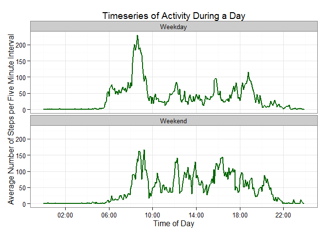

# Reproducible Research: Peer Assessment 1

This report is documents the analysis done for Peer assessment 1 for the Reproducible Research course. This analysis describes processing and interpretation of activity monitoring equipment worn by an anonymous subject for 2 months.  The data can be obtained here: <https://d396qusza40orc.cloudfront.net/repdata%2Fdata%2Factivity.zip>  

##Loading and preprocessing the data  
The first step is to collect the data an read it into a data frame that I am calling act_data.


```r
download.file("http://d396qusza40orc.cloudfront.net/repdata%2Fdata%2Factivity.zip","activity.zip")
unzip("activity.zip")
act_data<-read.csv("activity.csv")
```
##What is mean total number of steps taken per day?
To get a sense of the number of steps the individual took per day I need to aggregate the data to a daily time step and take the sum of those steps.  


```r
D_act_data<-aggregate(steps~date,act_data,sum)
hist(D_act_data$steps,breaks=9,main="Histogram of Daily Steps",ylab="Frequency",xlab="Number of steps per day",col="darkgreen")
```

 

```r
stepmean<-mean(D_act_data$steps,na.rm=T)
stepmedian<-median(D_act_data$steps,na.rm=T)
```
Based on the activity data, the mean and median steps taken per day were 1.0766189\times 10^{4} and 10765 respectively.  

##What is the average daily activity pattern?
To examine the pattern of activity during a day, the average number of steps data was aggregated into each 5 minute increment. To properly do this the interval integer needed to be converted to a true time series.


```r
#need to convert the integer interval into a true time series
library(stringr)
act_data$time<-sapply(as.character(act_data$interval),function(x) str_pad(x,4,side="left",pad="0"))
#
#Note the following adds a the current Year, Month and Day to the desired Hour and Minute.  THis does not impact
#this analysis as the aggregation is based on the time interval because the dates are identical. 
act_data$time<-strptime(act_data$time,"%H%M")
act_data$time<-as.POSIXct(act_data$time)
m_act_data<-aggregate(steps~time,act_data,mean)
library(ggplot2)
library(scales)
ggplot(m_act_data,aes(x=time,y=steps))+theme_bw()+geom_line(colour="blue",size=1)+
        scale_x_datetime(breaks=date_breaks("4 hours"),labels=c("00:00","02:00","06:00","10:00","14:00","18:00","22:00","00:00"))+
        labs(title="Timeseries of Activity During a Day",x="Time of Day", y="Average Number of Steps per Five Minute Interval")
```

 

##Imputing missing values
The next step is to see how estimating a missing value may effect the result of the mean number of steps taken per day.

```r
#Find the number of missing time periods
miss_act<-is.na(act_data$steps)
tot_missing<-length(act_data$steps[miss_act])
#Copy the data set to a new data set that we will fill in missing values with
adj_act_data<-act_data
#loop through the data set and check for missing values, if the value is missing assign a value based on the mean steps for an identical 5 minute period calculated in the above code chunk (variable m_act_data) 
for (i in 1:nrow(adj_act_data)){
        if(is.na(adj_act_data$steps[i])){adj_act_data$steps[i]<-m_act_data$steps[m_act_data$time==adj_act_data$time[i]]}
}
D_adj_act_data<-aggregate(steps~date,adj_act_data,sum)
hist(D_adj_act_data$steps,breaks=9,main="Histogram of Daily Steps",ylab="Frequency",xlab="Number of steps per day",col="khaki3")
```

 

```r
adjstepmean<-mean(D_adj_act_data$steps)
adjstepmedian<-median(D_adj_act_data$steps)
```
The total number of missing 5 minute intervals is 2304. The new mean and median for the data-set with values substituted for the missing values are 1.0766189\times 10^{4} and 1.0766189\times 10^{4} respectively. These values are different than the values from the original data-set that had missing data. Imputing missing data has the effect of increasing the mean and median values in this case. 

##Are there differences in activity patterns between weekdays and weekends?
This part of the analysis examines the difference in activity between weekdays and weekends. A panel plot was constructed to illustrate these differences.

```r
#Add a column of weekdays to the data set
adj_act_data$wkdy<-weekdays(as.Date(adj_act_data$date,"%Y-%m-%d"),abbreviate=T)
wkend<-grepl("S",adj_act_data$wkdy)
adj_act_data[wkend,5]<-"Weekend"
adj_act_data[!wkend,5]<-"Weekday"
madj_act_data<-aggregate(steps~time+wkdy,adj_act_data,mean)
ggplot(madj_act_data,aes(x=time,y=steps))+theme_bw()+facet_wrap(~wkdy,nrow=2)+geom_line(colour="darkgreen",size=1)+
        scale_x_datetime(breaks=date_breaks("4 hours"),labels=c("00:00","02:00","06:00","10:00","14:00","18:00","22:00","00:00"))+
        labs(title="Timeseries of Activity During a Day",x="Time of Day", y="Average Number of Steps per Five Minute Interval")
```

 

